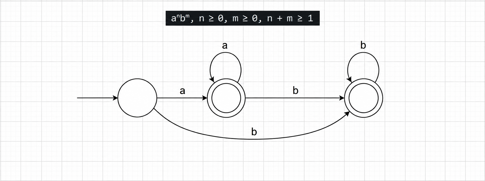
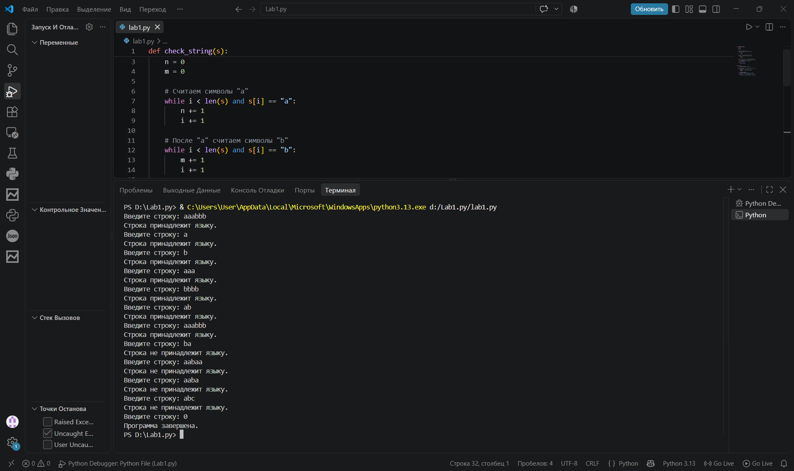

# Лабораторная работа №1

## Тема: Реализация конечного автомата для распознавания формальных языков

## Вариант задания

Язык:

**aⁿbᵐ, n ≥ 0, m ≥ 0, n + m ≥ 1**

Строка принадлежит языку, если она состоит из нуля или более символов `a`, после которых следует ноль или более символов `b`.

При этом строка должна содержать хотя бы один символ, так как выполняется условие:

**n + m ≥ 1**

Таким образом, допустимы строки, состоящие только из `a`, только из `b`, а также строки, в которых сначала идут символы `a`, а затем символы `b`.

Например:

`a`, `b`, `aaa`, `bbbb`, `ab`, `aab`, `aaabbb`.

Строки, в которых после символа `b` снова появляется `a`, языку не принадлежат.

---

## 1. Диаграмма конечного автомата

Автомат состоит из трёх основных состояний.

- Начальное состояние соответствует ситуации, когда ещё не был прочитан ни один символ.
- При чтении символа `a` автомат переходит в допускающее состояние, в котором может продолжать читать символы `a`.
- При появлении символа `b` автомат переходит в другое допускающее состояние.
- В состоянии чтения `b` допускаются только последующие символы `b`.
- Переход от `b` обратно к `a` отсутствует, поскольку по условию языка все символы `a` должны находиться перед символами `b`.

Начальное состояние не является допускающим, так как пустая строка не удовлетворяет условию `n + m ≥ 1`.

Двойным кругом на диаграмме обозначены допускающие состояния.

Диаграмма конечного автомата

---

## 2. Программная реализация

Программа на Python реализует логику конечного автомата.

Сначала программа последовательно считывает и подсчитывает символы `a`. После них подсчитываются символы `b`. В конце проверяется, была ли обработана вся строка и содержит ли она хотя бы один допустимый символ.

```python
def check_string(s):
    i = 0
    n = 0
    m = 0

    # Считаем символы "a"
    while i < len(s) and s[i] == "a":
        n += 1
        i += 1

    # После "a" считаем символы "b"
    while i < len(s) and s[i] == "b":
        m += 1
        i += 1

    # Проверяем, что строка обработана полностью
    # и содержит хотя бы один символ a или b
    if i == len(s) and n + m >= 1:
        return True
    else:
        return False


while True:
    s = input("Введите строку: ")

    # 0 используется для завершения программы
    if s == "0":
        print("Программа завершена.")
        break

    if check_string(s):
        print("Строка принадлежит языку.")
    else:
        print("Строка не принадлежит языку.")
```

---

## 3. Результаты тестирования

Для проверки работы программы были использованы корректные и некорректные входные строки.

Результат выполнения программы

| Входная строка | Ожидаемый результат | Результат программы |
|---|---|---|
| `a` | принадлежит | ✅ принадлежит |
| `b` | принадлежит | ✅ принадлежит |
| `aaa` | принадлежит | ✅ принадлежит |
| `bbbb` | принадлежит | ✅ принадлежит |
| `ab` | принадлежит | ✅ принадлежит |
| `aaabbb` | принадлежит | ✅ принадлежит |
| `ba` | не принадлежит | ✅ не принадлежит |
| `aabaa` | не принадлежит | ✅ не принадлежит |
| `aaba` | не принадлежит | ✅ не принадлежит |
| `abc` | не принадлежит | ✅ не принадлежит |

Все тестовые примеры подтверждают корректность работы программы.

Строки, состоящие из произвольного количества символов `a` с последующим произвольным количеством символов `b`, корректно распознаются как принадлежащие языку.

Строки с нарушенным порядком символов, например `ba` или `aaba`, а также строки, содержащие посторонние символы, например `abc`, отклоняются.

Условие `n + m ≥ 1` также исключает пустую строку.

---

## 4. Вывод

В ходе лабораторной работы был построен конечный автомат для распознавания языка

**aⁿbᵐ, n ≥ 0, m ≥ 0, n + m ≥ 1.**

Также была разработана программа на языке Python, реализующая логику данного автомата.

Программа последовательно анализирует входную строку и определяет её принадлежность заданному языку. Проведённое тестирование на корректных и некорректных входных данных подтвердило правильность работы разработанного решения.