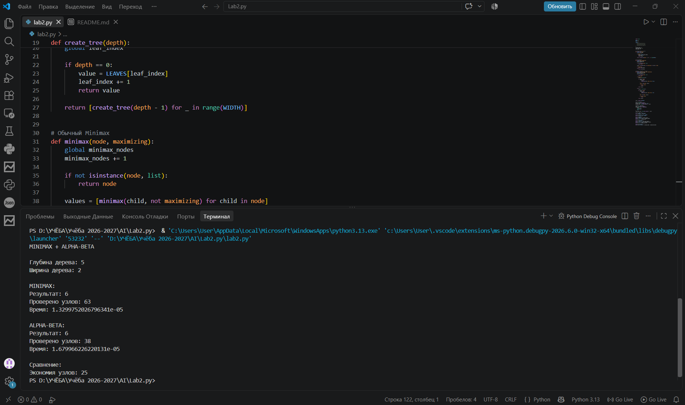

# Лабораторная работа: мини-макс с альфа-бета отсечением

## 1. Цель работы

Изучить алгоритм мини-макс и его оптимизацию с помощью альфа-бета отсечения, реализовать оба алгоритма рекурсивно для игрового дерева глубиной 5 и сравнить их эффективность по числу проверенных узлов и времени выполнения.

## 2. Теоретические сведения

**Мини-макс** применяется в антагонистических играх двух игроков. Игрок MAX стремится получить наибольшую оценку, игрок MIN — наименьшую. Значения листьев (оценки конечных позиций) поднимаются вверх по дереву: на уровнях MAX выбирается максимум из значений потомков, на уровнях MIN — минимум.

Значение корня показывает лучший результат, которого MAX может добиться при оптимальной игре соперника. Недостаток алгоритма состоит в том, что он обходит все узлы дерева, а их число растёт экспоненциально.

**Альфа-бета отсечение** даёт тот же результат, что и обычный мини-макс, но позволяет пропускать ветви, которые уже не могут повлиять на итог.

При обходе используются два параметра:

- `alpha` — лучшее значение, которое MAX уже гарантированно может получить;
- `beta` — лучшее значение, которое MIN уже гарантированно может получить.

Если выполняется условие:

```python
alpha >= beta
```

оставшиеся потомки текущего узла можно не проверять.

Эффективность альфа-бета отсечения зависит от порядка обхода потомков: чем раньше рассматриваются выгодные ходы, тем больше ветвей может быть отсечено.

## 3. Условия

**Вариант 1**

| Параметр | Значение |
| --- | --- |
| Глубина дерева | 5 |
| Ширина дерева | 2 (бинарное дерево) |
| Игроки | MAX (ходит в корне) и MIN, уровни чередуются |
| Листья | фиксированные целые значения |
| Реализация | рекурсивная, дерево хранится во вложенных списках |
| Метрики сравнения | число проверенных узлов, время выполнения |

Полное бинарное дерево глубины 5 содержит:

```text
2^5 = 32 листа
```

Общее количество узлов:

```text
1 + 2 + 4 + 8 + 16 + 32 = 63
```

Уровни дерева:

```text
Уровень 0: MAX
Уровень 1: MIN
Уровень 2: MAX
Уровень 3: MIN
Уровень 4: MAX
Уровень 5: листья
```

Для листьев используются фиксированные значения:

```python
LEAVES = [
    9, 8, 7, 6, 5, 4, 3, 2,
    8, 7, 6, 5, 4, 3, 2, 1,
    7, 6, 5, 4, 3, 2, 1, 0,
    6, 5, 4, 3, 2, 1, 0, -1
]
```

## 4. Описание программы

`create_tree(depth)` рекурсивно строит бинарное дерево. При `depth == 0` функция возвращает очередное фиксированное значение из списка `LEAVES`. Иначе создаётся список из двух поддеревьев.

`minimax(node, maximizing)` реализует обычный мини-макс. Если узел не является списком, он считается листом и возвращается его значение. Для внутренних узлов рекурсивно вычисляются значения потомков. Игрок MAX выбирает максимальное значение, а MIN — минимальное.

`alpha_beta(node, alpha, beta, maximizing)` реализует мини-макс с альфа-бета отсечением. Потомки проверяются по одному. Для MAX обновляется `alpha`, для MIN — `beta`. Если выполняется `alpha >= beta`, оставшиеся потомки текущего узла не проверяются.

Глобальные счётчики `minimax_nodes` и `alpha_beta_nodes` увеличиваются при каждом входе в соответствующую функцию и учитывают все посещённые узлы, включая листья.

Время выполнения измеряется с помощью `time.perf_counter()`.

Оба алгоритма запускаются на одном и том же дереве, поэтому сравнение является корректным.

## 5. Код

```python
import time

DEPTH = 5
WIDTH = 2

LEAVES = [
    9, 8, 7, 6, 5, 4, 3, 2,
    8, 7, 6, 5, 4, 3, 2, 1,
    7, 6, 5, 4, 3, 2, 1, 0,
    6, 5, 4, 3, 2, 1, 0, -1
]

minimax_nodes = 0
alpha_beta_nodes = 0
leaf_index = 0


def create_tree(depth):
    global leaf_index

    if depth == 0:
        value = LEAVES[leaf_index]
        leaf_index += 1
        return value

    return [create_tree(depth - 1) for _ in range(WIDTH)]


def minimax(node, maximizing):
    global minimax_nodes
    minimax_nodes += 1

    if not isinstance(node, list):
        return node

    values = [minimax(child, not maximizing) for child in node]

    if maximizing:
        return max(values)
    else:
        return min(values)


def alpha_beta(node, alpha, beta, maximizing):
    global alpha_beta_nodes
    alpha_beta_nodes += 1

    if not isinstance(node, list):
        return node

    if maximizing:
        result = -float("inf")

        for child in node:
            result = max(
                result,
                alpha_beta(child, alpha, beta, False)
            )

            alpha = max(alpha, result)

            if alpha >= beta:
                break

        return result

    else:
        result = float("inf")

        for child in node:
            result = min(
                result,
                alpha_beta(child, alpha, beta, True)
            )

            beta = min(beta, result)

            if alpha >= beta:
                break

        return result


tree = create_tree(DEPTH)

start = time.perf_counter()
minimax_result = minimax(tree, True)
minimax_time = time.perf_counter() - start

start = time.perf_counter()
alpha_beta_result = alpha_beta(
    tree,
    -float("inf"),
    float("inf"),
    True
)
alpha_beta_time = time.perf_counter() - start

print("MINIMAX + ALPHA-BETA")

print("\nГлубина дерева:", DEPTH)
print("Ширина дерева:", WIDTH)

print("\nMINIMAX:")
print("Результат:", minimax_result)
print("Проверено узлов:", minimax_nodes)
print("Время:", minimax_time)

print("\nALPHA-BETA:")
print("Результат:", alpha_beta_result)
print("Проверено узлов:", alpha_beta_nodes)
print("Время:", alpha_beta_time)

print("\nСравнение:")
print("Экономия узлов:", minimax_nodes - alpha_beta_nodes)
```

## 6. Результат работы

Для заданных фиксированных значений листьев оба алгоритма возвращают одинаковое значение корня:

```text
6
```

Обычный мини-макс проверяет все 63 узла дерева.

Альфа-бета отсечение при данном порядке обхода проверяет 38 узлов.

Пример результата:



| Алгоритм | Значение корня | Проверено узлов | Время, с |
|---|---:|---:|---:|
| Мини-макс | 6 | 63 | 0,0000133 |
| Альфа-бета | 6 | 38 | 0,0000168 |


Мини-макс проверяет все 63 узла дерева. Альфа-бета обходит только 38 узлов, то есть позволяет не посещать 25 узлов.

Процент экономии:

```text
25 / 63 × 100% ≈ 39,7%
```

Таким образом, при данном порядке обхода количество посещённых узлов уменьшается примерно на **39,7%**, при этом значение корня остаётся тем же.

В данном запуске время выполнения мини-макса составило примерно 0,0000133 с, а альфа-бета — 0,0000168 с. Небольшая разница во времени на таком маленьком дереве может изменяться между запусками из-за погрешности измерения и нагрузки системы.

## 7. Анализ результатов

**Корректность.** Оба алгоритма вернули одинаковое значение корня — `6`. Следовательно, альфа-бета отсечение не изменяет результат мини-макса, а только исключает вычисления, которые уже не могут повлиять на окончательный выбор.

**Число узлов.** Обычный мини-макс всегда проверяет все 63 узла данного дерева. Альфа-бета алгоритм при выбранном расположении листьев проверяет 38 узлов. Экономия составляет 25 узлов, или примерно 39,7%.

**Время.** Дерево содержит всего 63 узла, поэтому оба алгоритма выполняются очень быстро. На таком небольшом объёме данных разница во времени может быть нестабильной, поскольку на результат измерения влияют накладные расходы интерпретатора и текущая нагрузка системы. Более наглядной метрикой в данном случае является количество посещённых узлов.

**Порядок обхода.** Эффективность альфа-бета отсечения зависит от порядка проверки потомков. Если хорошие для текущего игрока варианты рассматриваются раньше, значения `alpha` и `beta` быстрее ограничивают допустимый диапазон и больше ветвей отсекается.

**Масштабирование.** С увеличением глубины и ширины игрового дерева число узлов быстро растёт. Поэтому возможность не проверять заведомо ненужные ветви становится значительно важнее для больших игровых деревьев.

## 8. Вывод

В работе реализованы рекурсивные алгоритмы мини-макс и мини-макс с альфа-бета отсечением для бинарного игрового дерева глубиной 5 с фиксированными значениями листьев.

Полное дерево содержит 32 листа и 63 узла.

Оба алгоритма получили одинаковое значение корня — `6`, что подтверждает корректность альфа-бета отсечения.

Обычный мини-макс проверил все 63 узла, а алгоритм с альфа-бета отсечением — 38 узлов. Экономия составила 25 узлов, или примерно 39,7%.

Таким образом, альфа-бета отсечение позволяет уменьшить количество рассматриваемых узлов без изменения результата мини-макса. При увеличении размера игрового дерева преимущество такой оптимизации становится более существенным.
